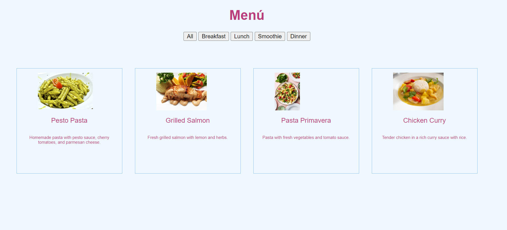
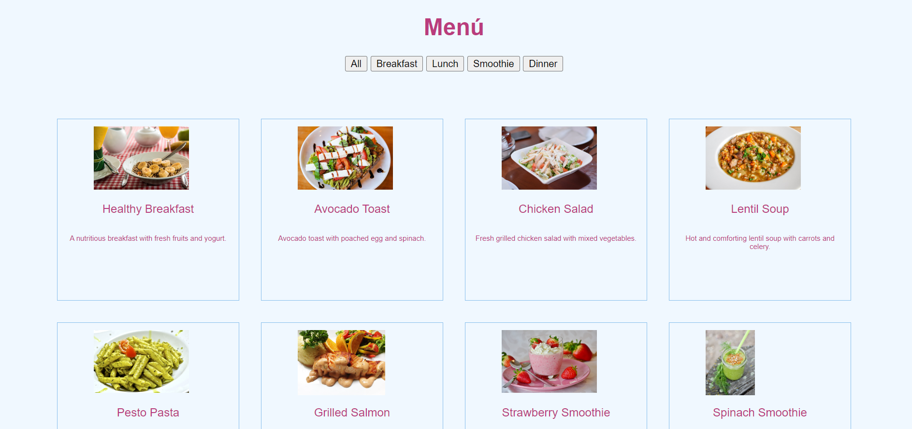
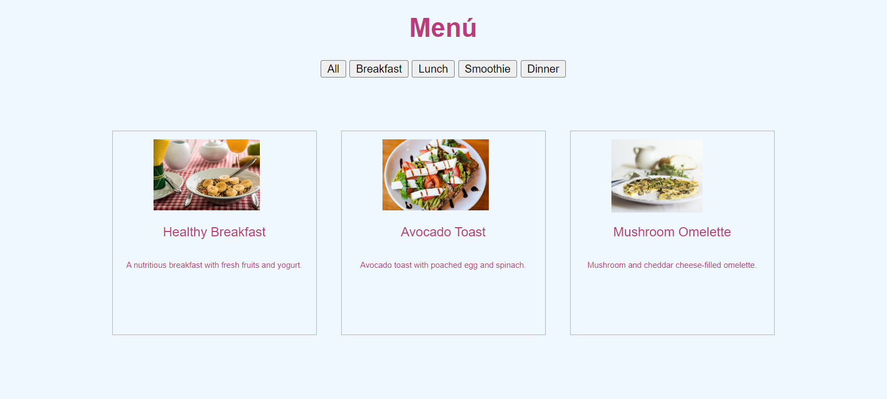

# Restaurant Menu Filter

This project provides a user-friendly restaurant menu that allows customers to filter available food items based on categories such as appetizers, main courses, and desserts. It's perfect for any restaurant website looking to showcase its menu in an organized and interactive way.

## Features

- A dynamic menu with food items.
- Interactive filtering buttons that allow customers to easily find their desired items.
- Responsive design that adapts to different screen sizes.

## Screenshots

*Full Menu*

*Filtered Menu*

## Getting Started

Start a local server to serve the JSON data. You can use tools like json-server to create a local API.
json-server --watch menu.json

## Technologies Used

- HTML
- CSS
- JavaScript
- JSON (for food item data)

